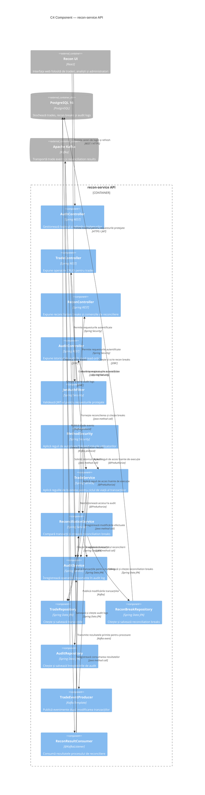

```mermaid
C4Component
    title C4 Component — recon-service API

    Container_Ext(ui, "Recon UI", "React", "Interfața web folosită de traderi, analiști și administratori")

    ContainerDb_Ext(postgres, "PostgreSQL 16", "PostgreSQL", "Stochează trades, recon breaks și audit logs")

    ContainerQueue_Ext(kafka, "Apache Kafka", "Kafka", "Transportă trade events și reconciliation results")

    Container_Boundary(apiBoundary, "recon-service API") {

        Component(authController, "AuthController", "Spring REST", "Gestionează login-ul și refresh-ul tokenurilor")

        Component(tradeController, "TradeController", "Spring REST", "Expune operațiile CRUD pentru trades")

        Component(reconController, "ReconController", "Spring REST", "Expune reconciliation breaks și comenzile de reconciliere")

        Component(auditController, "AuditController", "Spring REST", "Expune istoricul de audit în mod read-only")


        Component(jwtAuthFilter, "JwtAuthFilter", "Spring Security", "Validează JWT-ul pentru requesturile protejate")

        Component(methodSecurity, "MethodSecurity", "Spring Security", "Aplică reguli de autorizare folosind rolurile utilizatorilor")


        Component(tradeService, "TradeService", "Spring Service", "Aplică regulile de business pentru ciclul de viață al tranzacțiilor")

        Component(reconciliationService, "ReconciliationService", "Spring Service", "Compară tranzacții și creează reconciliation breaks")

        Component(auditService, "AuditService", "Spring Service", "Înregistrează operațiile importante în audit log")


        Component(tradeRepository, "TradeRepository", "Spring Data JPA", "Citește și salvează tranzacțiile")

        Component(reconBreakRepository, "ReconBreakRepository", "Spring Data JPA", "Citește și salvează reconciliation breaks")

        Component(auditRepository, "AuditRepository", "Spring Data JPA", "Citește și salvează înregistrările de audit")


        Component(tradeEventProducer, "TradeEventProducer", "KafkaTemplate", "Publică evenimente după modificarea tranzacțiilor")

        Component(reconResultConsumer, "ReconResultConsumer", "@KafkaListener", "Consumă rezultatele procesului de reconciliere")
    }


    Rel(ui, authController, "Trimite cereri de login și refresh", "REST / HTTPS")

    Rel(ui, jwtAuthFilter, "Trimite tokenul pentru requesturile protejate", "HTTPS / JWT")

    Rel(jwtAuthFilter, tradeController, "Permite requesturile autentificate", "Spring Security")

    Rel(jwtAuthFilter, reconController, "Permite requesturile autentificate", "Spring Security")

    Rel(jwtAuthFilter, auditController, "Permite requesturile autentificate", "Spring Security")


    Rel(tradeController, tradeService, "Execută operații asupra tranzacțiilor", "Java method call")

    Rel(reconController, reconciliationService, "Pornește reconcilierea și citește breaks", "Java method call")

    Rel(auditController, auditService, "Solicită istoricul de audit", "Java method call")


    Rel(methodSecurity, tradeService, "Aplică reguli de acces înainte de execuție", "@PreAuthorize")

    Rel(methodSecurity, reconciliationService, "Aplică reguli de acces înainte de execuție", "@PreAuthorize")

    Rel(methodSecurity, auditService, "Restricționează accesul la audit", "@PreAuthorize")


    Rel(tradeService, tradeRepository, "Citește și salvează tranzacții", "Spring Data JPA")

    Rel(tradeService, tradeEventProducer, "Publică modificările tranzacțiilor", "Kafka")

    Rel(tradeService, auditService, "Înregistrează modificările efectuate", "Java method call")


    Rel(reconciliationService, tradeRepository, "Încarcă tranzacțiile pentru matching", "Spring Data JPA")

    Rel(reconciliationService, reconBreakRepository, "Salvează și citește reconciliation breaks", "Spring Data JPA")

    Rel(reconciliationService, auditService, "Înregistrează rezultatul reconcilierii", "Java method call")


    Rel(auditService, auditRepository, "Salvează și citește audit logs", "Spring Data JPA")


    Rel(reconResultConsumer, reconciliationService, "Transmite rezultatele primite pentru procesare", "Kafka event")

    Rel(reconResultConsumer, auditService, "Înregistrează consumarea rezultatelor", "Java method call")


    Rel(tradeRepository, postgres, "Citește și scrie trades", "JDBC")

    Rel(reconBreakRepository, postgres, "Citește și scrie recon breaks", "JDBC")

    Rel(auditRepository, postgres, "Citește și scrie audit logs", "JDBC")


    Rel(tradeEventProducer, kafka, "Publică trade events", "Kafka protocol")

    Rel(kafka, reconResultConsumer, "Livrează reconciliation results", "Kafka protocol")


    UpdateLayoutConfig($c4ShapeInRow="3", $c4BoundaryInRow="1")
```