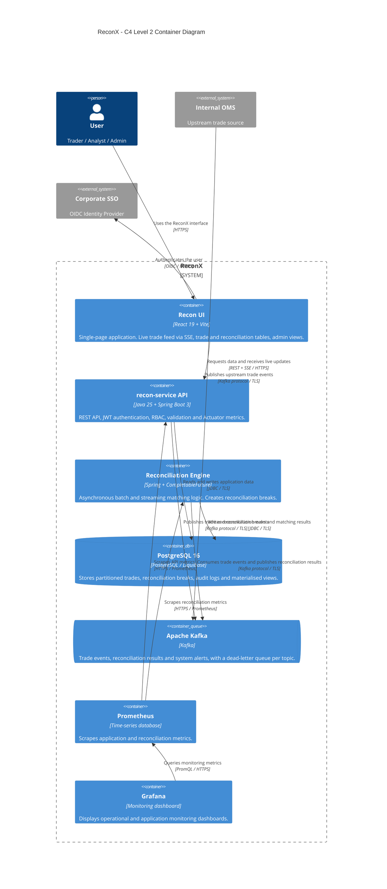

```mermaid
C4Container
    title ReconX - C4 Level 2 Container Diagram

    Person(user, "User", "Trader / Analyst / Admin")

    System_Ext(oms, "Internal OMS", "Upstream trade source")
    System_Ext(sso, "Corporate SSO", "OIDC Identity Provider")

    System_Boundary(reconxBoundary, "ReconX") {

        Container(ui, "Recon UI", "React 19 + Vite", "Single-page application. Live trade feed via SSE, trade and reconciliation tables, admin views.")

        Container(api, "recon-service API", "Java 25 + Spring Boot 3", "REST API, JWT authentication, RBAC, validation and Actuator metrics.")

        Container(engine, "Reconciliation Engine", "Spring + CompletableFuture", "Asynchronous batch and streaming matching logic. Creates reconciliation breaks.")

        ContainerDb(postgres, "PostgreSQL 16", "PostgreSQL / Liquibase", "Stores partitioned trades, reconciliation breaks, audit logs and materialised views.")

        ContainerQueue(kafka, "Apache Kafka", "Kafka", "Trade events, reconciliation results and system alerts, with a dead-letter queue per topic.")

        Container(prometheus, "Prometheus", "Time-series database", "Scrapes application and reconciliation metrics.")

        Container(grafana, "Grafana", "Monitoring dashboard", "Displays operational and application monitoring dashboards.")
    }

    Rel(user, ui, "Uses the ReconX interface", "HTTPS")

    Rel(ui, sso, "Authenticates the user", "OIDC / HTTPS")
    Rel(ui, api, "Requests data and receives live updates", "REST + SSE / HTTPS")

    Rel(oms, kafka, "Publishes upstream trade events", "Kafka protocol / TLS")

    Rel(api, postgres, "Reads and writes application data", "JDBC / TLS")
    Rel(api, kafka, "Publishes trade and reconciliation events", "Kafka protocol / TLS")

    Rel(engine, kafka, "Consumes trade events and publishes reconciliation results", "Kafka protocol / TLS")
    Rel(engine, postgres, "Writes reconciliation breaks and matching results", "JDBC / TLS")

    Rel(prometheus, api, "Scrapes API metrics", "HTTPS / Prometheus")
    Rel(prometheus, engine, "Scrapes reconciliation metrics", "HTTPS / Prometheus")

    Rel(grafana, prometheus, "Queries monitoring metrics", "PromQL / HTTPS")

    UpdateLayoutConfig($c4ShapeInRow="3", $c4BoundaryInRow="1")
```