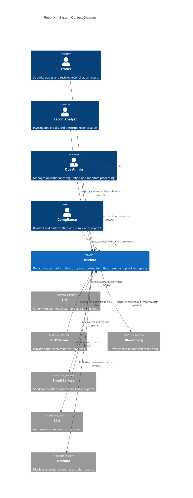

```mermaid
C4Context
    title ReconX – System Context Diagram

    Person(trader, "Trader", "Submits trades and reviews reconciliation results")
    Person(analyst, "Recon Analyst", "Investigates breaks and performs reconciliation")
    Person(ops, "Ops Admin", "Manages operational configuration and monitors processing")
    Person(compliance, "Compliance", "Reviews audit information and compliance reports")

    System(reconx, "ReconX", "Reconciliation platform that compares trades, identifies breaks, and provides reports")

    System_Ext(oms, "OMS", "Order Management System providing trade data")
    System_Ext(sftp, "SFTP Server", "Provides and receives batch trade files")
    System_Ext(bloomberg, "Bloomberg", "Provides market and reference data")
    System_Ext(email, "Email Service", "Sends notifications and reconciliation reports")
    System_Ext(sso, "SSO", "Authenticates and authorizes users")
    System_Ext(grafana, "Grafana", "Displays operational metrics and dashboards")

    Rel(trader, reconx, "Submits trades and reviews results", "HTTPS")
    Rel(analyst, reconx, "Investigates reconciliation breaks", "HTTPS")
    Rel(ops, reconx, "Configures and monitors processing", "HTTPS")
    Rel(compliance, reconx, "Reviews audit and compliance reports", "HTTPS")

    Rel(oms, reconx, "Sends trade and order data", "Kafka")
    Rel(sftp, reconx, "Exchanges batch trade files", "SFTP")
    Rel(reconx, bloomberg, "Retrieves market and reference data", "HTTPS")
    Rel(reconx, email, "Sends alerts and reports", "SMTP")
    Rel(reconx, sso, "Authenticates users", "OIDC")
    Rel(reconx, grafana, "Publishes operational metrics", "HTTPS")
```